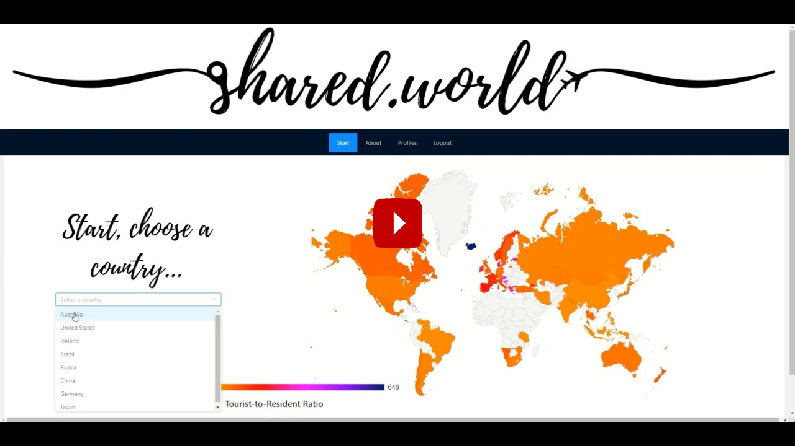
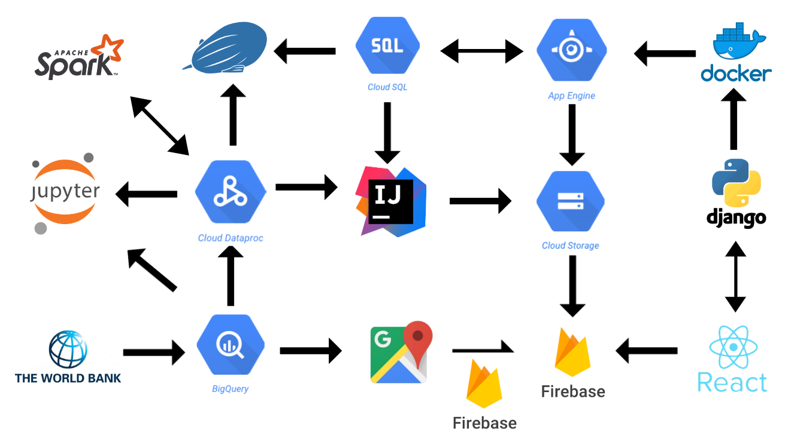

[Back to Home](https://teanlouise.github.io)

Overview    |     [Develop](https://teanlouise.github.io/shared-world/develop)    |   [Deploy](https://teanlouise.github.io/shared-world/deploy)    |   [Data](https://teanlouise.github.io/shared-world-data)

This project was the assessment item for INFS3208 (Cloud Computing) at University of Queensland. The [proposal](https://teanlouise.github.io/shared-world/proposal) was submitted as assignment 1 and this [implementation](https://shared-world.web.app) as assignment 2. This project was nominated for the best project award and was awarded the 'Best Use of Cloud' for the cohort. A live and recorded explanation, including demonstration of the project was given. 

# Purpose
A cloud application solution for overtourism and promoting responsible travel by providing a platform where travellers explore destinations using a map displaying tourist-to-local ratios and view blogs filtered by their interests. It is a platform where responsible, conscientious travellers can be made. 

# Goals
1.	educate travellers
2.	show only relevant posts
3.	informative map
4.	improve quality of travel blogs

# Technologies

The application was written in Django and React, deployed on Google App Engine through docker and Firebase respectively, the database hosted on Cloud SQL and the file storage on Cloud Storage. BigQuery was used to query data from the World Bank dataset, Apache Spark clusters were managed via Dataproc in which a Scala program was run using SparkSQL, as well as an Apache Zeppelin notebook for data analysis using Scala and a Jupyter notebook to create a linear regression model with PySpark. 

# Workflow

The application was written in Django and React, deployed on Google App Engine through docker and Firebase respectively, the database hosted on Cloud SQL and the file storage on Cloud Storage. BigQuery was used to query data from the World Bank dataset, Apache Spark clusters were managed via Dataproc in which a Scala program was run using SparkSQL, as well as an Apache Zeppelin notebook for data analysis using Scala and a Jupyter notebook to create a linear regression model with PySpark.

There are three main parts to this project:

1. [Develop](https://teanlouise.github.io/shared-world/develop)

2. [Deploy](https://teanlouise.github.io/shared-world/deploy)

3. [Data](https://teanlouise.github.io/shared-world-data)
