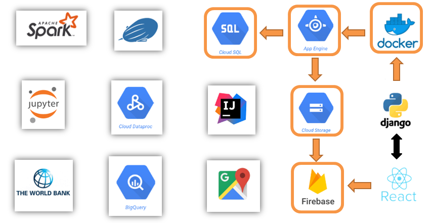
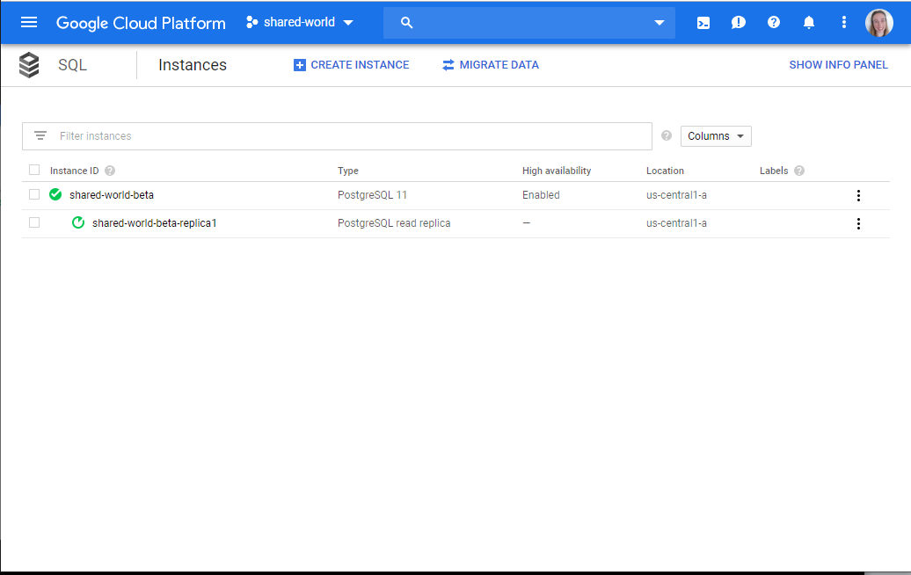
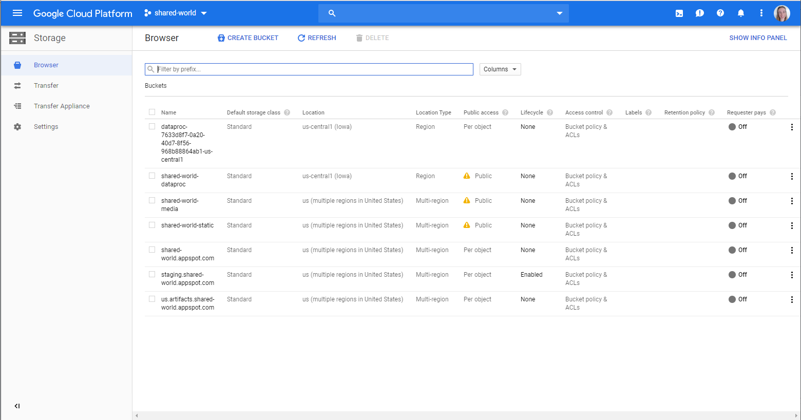
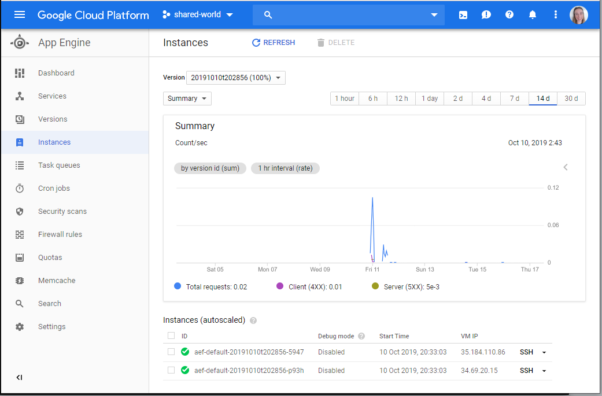
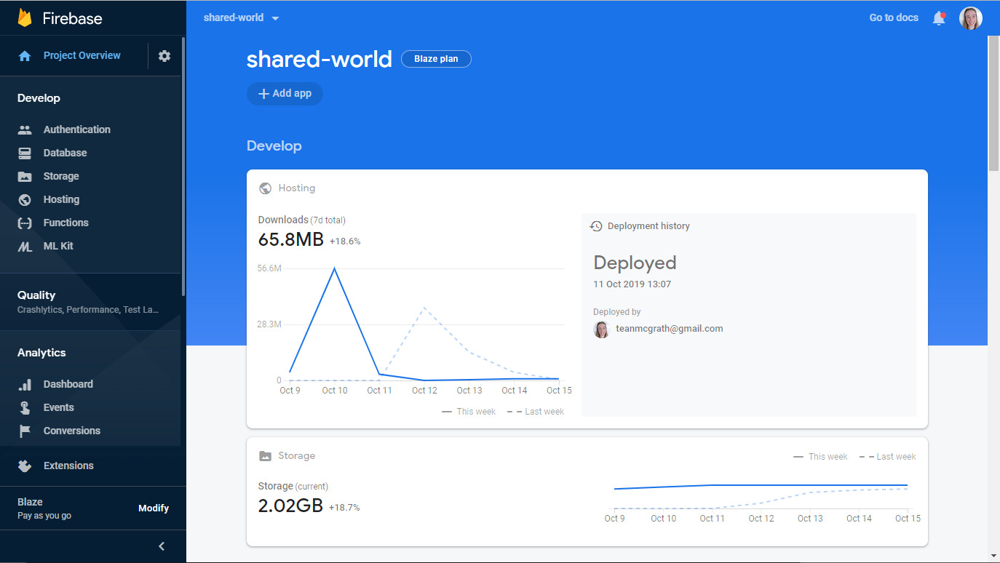

[Back to Home](https://teanlouise.github.io)


[Overview](https://teanlouise.github.io/shared-world)     |     [Develop](https://teanlouise.github.io/shared-world/develop)   |  Deploy    |   [Data](https://teanlouise.github.io/shared-world-data)

This application is deployed on Google Cloud Platform using App Engine Flexible Environment, CloudSQL (PostgreSQL), Cloud Storage and Firebase.



### Getting Started

- Get Cloud SDK

# Database - Cloud SQL



[Connect Django to Google Cloud SQL](https://stackoverflow.com/questions/19086517/connect-django-to-google-cloud-sql) with a PostgreSQL instance to [deploy Django to Google App Engine](https://medium.com/@BennettGarner/deploying-a-django-application-to-google-app-engine-f9c91a30bd35). The PostgreSQL instance has read replicas and high availability to replicate that of a cluster environment for distributed data sharing.

- Go to Cloud SQL console
-	Create Postgres instance (shared-world-beta, contiki123)
-	Go to Cloud SDK
-	Enable Cloud SQL API in Cloud SDK
```
gcloud services enable sqladmin
```
-	Get connection name instance in Cloud SDK
```
gcloud sql instances describe shared-world-beta
```
-	Install CloudSQL proxy onto computer and resave as cloud_sql_proxy.exe 
-	Open terminal and use proxy to run locally
```
.\cloud_sql_proxy.exe –instances=”shared-world:us-central1:shared-world-beta”=tcp:5432
```
-	Go back to GCP console and create database under instance (shared-world-database)
-	Create user (postgres, contiki123)
-	Go to Django settings.py and add configuration
-	May need to install psycop2
```
pip install psycopg2-binary
```
-	Remove all migrations from folders
-	Need to save that all removed
```
python manage.py makemigrations
python manage.py migrate
```
-	Create new superuser for new database
```
python manage.py createsuperuser
```

# File Storage - Cloud Storage



All static and media files are on Google Cloud Storage (for this application this was the best choice over a DFS)

### Media:
Use [Django Storage](https://django-storages.readthedocs.io/en/latest/backends/gcloud.html) to allow media files to be served from Google Cloud Storage. Media images are stored in seperate folder for each app (post_pics, country_pics and profile_pics).

-	Go to GCP console and create service account under IAM 
-	Download JSON file
-	Create a  bucket for  media (shared-world-media)
-	Make bucket public
-	Install Django file API
```
pip install django-storage
```
-	Add GCS details to Django settings.py with it as the default file storage

### Static:
-	Create bucket in google cloud (shared-world-static)
-	Make bucket public
-	Add to settings.py

# Backend - Google App Engine



 Django was deployed on [Google Flexible Environment](https://cloud.google.com/python/django/flexible-environment) with some helpful [guidelines](https://codeburst.io/beginners-guide-to-deploying-a-django-postgresql-project-on-google-cloud-s-flexible-app-engine-e3357b601b91). 

When deployed it is converted to a docker image and run on a default of 2 VM instances. It looks at the applications app.yaml file for the relevant information (eg. Runtime environment, environment variables, etc).

-	Create project on app engine [shared-world]
-	Add backend website and localhost to ALLOWED_HOSTS
-	Create service account credentials on GCP and add to settings
-	Import service account into settings.py – shared_world
```
from google.oauth2 import service_account
```
- Need to create requirements.txt and yaml file
-	Install CloudSDK and deploy
```
gcloud init
gcloud auth application-default login
gcloud app deploy
```
-	Check that running once finished with provided URL (shared-world.appspot.com)

# Frontend - Google Firebase



Originally to be deployed on app engine, however this was not the best option. Instead, deployed on Google Firebase which is designed for easy deployment of frontend apps. Due to the API nature of this program and Django they could be deployed separately. This structure provided greater efficiency and results then when running together locally.

-	Go to firebase console and create a project
-	Install Firebase tools
```
npm install –g firebase-tools
```
•	Login to firebase
```
firebase login
```
•	Collect all the files to deploy
```
npm run build
```
•	Deploy
```
firebase deploy
```
