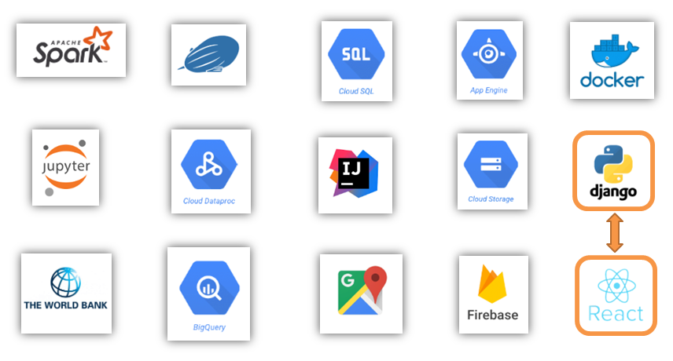

[Back to Home](https://teanlouise.github.io)

[Overview](https://teanlouise.github.io/shared-world)     |     Develop    |  [Deploy](https://teanlouise.github.io/shared-world/deploy)    |   [Data](https://teanlouise.github.io/shared-world-data)

The project used Django and React.

- **[Backend](https://teanlouise.github.io/shared-world-backend):** Django
- **[Frontend](https://teanlouise.github.io/shared-world-frontend):** React

